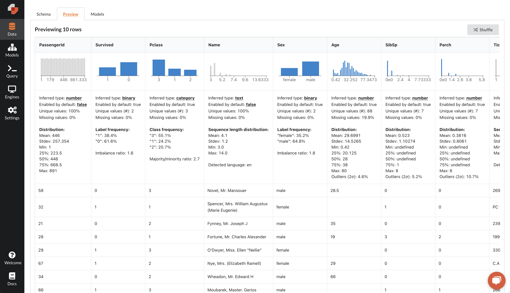
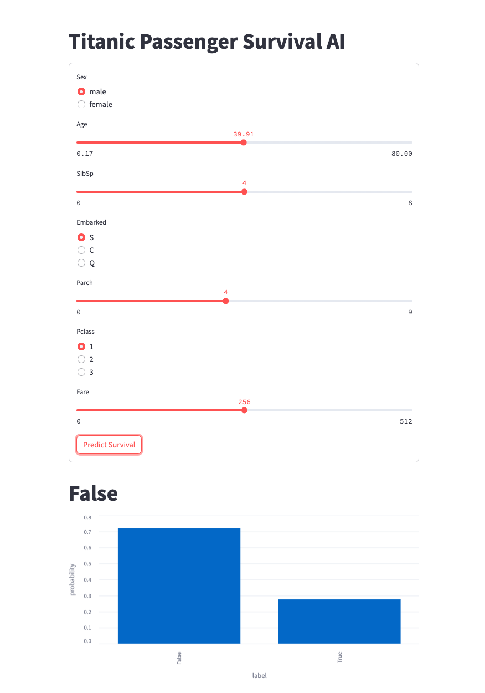
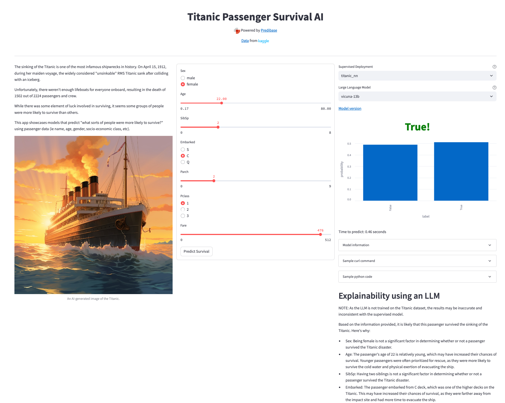

# Build and deploy a machine learning web app predicting titanic survivorship in 30 minutes with Predibase and Streamlit


Get the app running right away:

```
python -m venv env
source env/bin/activate
pip install -r requirements.txt
export PREDIBASE_API_TOKEN=<>
streamlit run app.py
```

# Overview

In this tutorial, we will show you how anyone can leverage Predibase to:

1. Connect data.
2. Train machine learning models.
3. Deploy a machine learning model.
4. Build a simple Predibase-Streamlit web app in Python.
5. Launch the app using Streamlit Cloud.

For the sake of this tutorial, we’ll focus on Titanic Survivorship, but the same steps can be used to build a demo app for any machine learning use case in your organization. Learn more at [predibase.com](http://predibase.com).

We've provided UI screenshots as well as SDK code snipppets. The `Titanic_Survivorship` python notebook is also provided
for your convenience.

## Files in this repo

- `app_minimal.py`: The bare bones web app demo that takes in feature values for querying a deployed Predibase model.
- `app.py`: A fully dressed up titanic survivorship app.
- `README.md`: This file.
- `requirements.txt`: A list of requirements for streamlit cloud.
- `Titanic_Surviorship_Model_Training_and_Deployment.ipynb`: Jupyter notebook for training and deploying models with the Predibase SDK.
- `titanic.png`: A midjourney-generated picture of the titanic.

# Part 1: Train and Deploy a Model

## Step A: Create a Predibase account

Sign up for a free [14-day free trial](https://predibase.com/free-trial) (it's completely free, we promise!). This gives you unrestricted access to the Predibase SDK, supervised ML features, document indexing, and all of Predibase’s LLM offerings.


## Step B: Download Titanic Dataset from Kaggle

Go to [https://www.kaggle.com/competitions/titanic](https://www.kaggle.com/competitions/titanic)

#### 1. Click on Join Competition

![https://images.tango.us/workflows/0c7b3b87-f115-4d16-8a2f-66a81842b3bb/steps/0fde9317-d3fe-4406-b979-6483cf812ca9/bf88f0ec-785b-4df0-b7bc-6e5c6cc80e6c.png?crop=focalpoint&fit=crop&fp-x=0.8666&fp-y=0.3310&fp-z=2.9070&w=1200&border=2%2CF4F2F7&border-radius=8%2C8%2C8%2C8&border-radius-inner=8%2C8%2C8%2C8&blend-align=bottom&blend-mode=normal&blend-x=0&blend-w=1200&blend64=aHR0cHM6Ly9pbWFnZXMudGFuZ28udXMvc3RhdGljL21hZGUtd2l0aC10YW5nby13YXRlcm1hcmstdjIucG5n&mark-x=506&mark-y=398&m64=aHR0cHM6Ly9pbWFnZXMudGFuZ28udXMvc3RhdGljL2JsYW5rLnBuZz9tYXNrPWNvcm5lcnMmYm9yZGVyPTYlMkNGRjc0NDImdz00NTkmaD0xMTcmZml0PWNyb3AmY29ybmVyLXJhZGl1cz0xMA%3D%3D](https://images.tango.us/workflows/0c7b3b87-f115-4d16-8a2f-66a81842b3bb/steps/0fde9317-d3fe-4406-b979-6483cf812ca9/bf88f0ec-785b-4df0-b7bc-6e5c6cc80e6c.png?crop=focalpoint&fit=crop&fp-x=0.8666&fp-y=0.3310&fp-z=2.9070&w=1200&border=2%2CF4F2F7&border-radius=8%2C8%2C8%2C8&border-radius-inner=8%2C8%2C8%2C8&blend-align=bottom&blend-mode=normal&blend-x=0&blend-w=1200&blend64=aHR0cHM6Ly9pbWFnZXMudGFuZ28udXMvc3RhdGljL21hZGUtd2l0aC10YW5nby13YXRlcm1hcmstdjIucG5n&mark-x=506&mark-y=398&m64=aHR0cHM6Ly9pbWFnZXMudGFuZ28udXMvc3RhdGljL2JsYW5rLnBuZz9tYXNrPWNvcm5lcnMmYm9yZGVyPTYlMkNGRjc0NDImdz00NTkmaD0xMTcmZml0PWNyb3AmY29ybmVyLXJhZGl1cz0xMA%3D%3D)

#### 2. Sign in or create a Kaggle account with one click.

![https://images.tango.us/workflows/0c7b3b87-f115-4d16-8a2f-66a81842b3bb/steps/014535de-a68e-40ae-ae6f-83b4e0ee5555/c57febb3-418a-4a89-b95b-43a43b38a2fe.png?crop=focalpoint&fit=crop&fp-x=0.5000&fp-y=0.3290&fp-z=1.8672&w=1200&border=2%2CF4F2F7&border-radius=8%2C8%2C8%2C8&border-radius-inner=8%2C8%2C8%2C8&blend-align=bottom&blend-mode=normal&blend-x=0&blend-w=1200&blend64=aHR0cHM6Ly9pbWFnZXMudGFuZ28udXMvc3RhdGljL21hZGUtd2l0aC10YW5nby13YXRlcm1hcmstdjIucG5n&mark-x=336&mark-y=415&m64=aHR0cHM6Ly9pbWFnZXMudGFuZ28udXMvc3RhdGljL2JsYW5rLnBuZz9tYXNrPWNvcm5lcnMmYm9yZGVyPTYlMkNGRjc0NDImdz01MjgmaD04MiZmaXQ9Y3JvcCZjb3JuZXItcmFkaXVzPTEw](https://images.tango.us/workflows/0c7b3b87-f115-4d16-8a2f-66a81842b3bb/steps/014535de-a68e-40ae-ae6f-83b4e0ee5555/c57febb3-418a-4a89-b95b-43a43b38a2fe.png?crop=focalpoint&fit=crop&fp-x=0.5000&fp-y=0.3290&fp-z=1.8672&w=1200&border=2%2CF4F2F7&border-radius=8%2C8%2C8%2C8&border-radius-inner=8%2C8%2C8%2C8&blend-align=bottom&blend-mode=normal&blend-x=0&blend-w=1200&blend64=aHR0cHM6Ly9pbWFnZXMudGFuZ28udXMvc3RhdGljL21hZGUtd2l0aC10YW5nby13YXRlcm1hcmstdjIucG5n&mark-x=336&mark-y=415&m64=aHR0cHM6Ly9pbWFnZXMudGFuZ28udXMvc3RhdGljL2JsYW5rLnBuZz9tYXNrPWNvcm5lcnMmYm9yZGVyPTYlMkNGRjc0NDImdz01MjgmaD04MiZmaXQ9Y3JvcCZjb3JuZXItcmFkaXVzPTEw)

#### 3. Once you’ve logged in, click on Data.

![https://images.tango.us/workflows/0c7b3b87-f115-4d16-8a2f-66a81842b3bb/steps/1d30fc06-c7b9-4d56-80e4-7c7456fe76e2/9de14a95-b7d3-40a0-8e1a-8b145202e5df.png?crop=focalpoint&fit=crop&fp-x=0.3256&fp-y=0.3310&fp-z=2.8249&w=1200&border=2%2CF4F2F7&border-radius=8%2C8%2C8%2C8&border-radius-inner=8%2C8%2C8%2C8&blend-align=bottom&blend-mode=normal&blend-x=0&blend-w=1200&blend64=aHR0cHM6Ly9pbWFnZXMudGFuZ28udXMvc3RhdGljL21hZGUtd2l0aC10YW5nby13YXRlcm1hcmstdjIucG5n&mark-x=539&mark-y=386&m64=aHR0cHM6Ly9pbWFnZXMudGFuZ28udXMvc3RhdGljL2JsYW5rLnBuZz9tYXNrPWNvcm5lcnMmYm9yZGVyPTYlMkNGRjc0NDImdz0xMjEmaD0xMzkmZml0PWNyb3AmY29ybmVyLXJhZGl1cz0xMA%3D%3D](https://images.tango.us/workflows/0c7b3b87-f115-4d16-8a2f-66a81842b3bb/steps/1d30fc06-c7b9-4d56-80e4-7c7456fe76e2/9de14a95-b7d3-40a0-8e1a-8b145202e5df.png?crop=focalpoint&fit=crop&fp-x=0.3256&fp-y=0.3310&fp-z=2.8249&w=1200&border=2%2CF4F2F7&border-radius=8%2C8%2C8%2C8&border-radius-inner=8%2C8%2C8%2C8&blend-align=bottom&blend-mode=normal&blend-x=0&blend-w=1200&blend64=aHR0cHM6Ly9pbWFnZXMudGFuZ28udXMvc3RhdGljL21hZGUtd2l0aC10YW5nby13YXRlcm1hcmstdjIucG5n&mark-x=539&mark-y=386&m64=aHR0cHM6Ly9pbWFnZXMudGFuZ28udXMvc3RhdGljL2JsYW5rLnBuZz9tYXNrPWNvcm5lcnMmYm9yZGVyPTYlMkNGRjc0NDImdz0xMjEmaD0xMzkmZml0PWNyb3AmY29ybmVyLXJhZGl1cz0xMA%3D%3D)

#### 4. Scroll to the end of the page and click on Download All.

![https://images.tango.us/workflows/0c7b3b87-f115-4d16-8a2f-66a81842b3bb/steps/1f155e72-6329-4385-aeb0-edd60ebecc8f/36fc1c56-2bf3-4c70-b41a-963e7a8fd3d6.png?crop=focalpoint&fit=crop&fp-x=0.8465&fp-y=0.7940&fp-z=4.0000&w=1200&border=2%2CF4F2F7&border-radius=8%2C8%2C8%2C8&border-radius-inner=8%2C8%2C8%2C8&blend-align=bottom&blend-mode=normal&blend-x=0&blend-w=1200&blend64=aHR0cHM6Ly9pbWFnZXMudGFuZ28udXMvc3RhdGljL21hZGUtd2l0aC10YW5nby13YXRlcm1hcmstdjIucG5n&mark-x=323&mark-y=376&m64=aHR0cHM6Ly9pbWFnZXMudGFuZ28udXMvc3RhdGljL2JsYW5rLnBuZz9tYXNrPWNvcm5lcnMmYm9yZGVyPTYlMkNGRjc0NDImdz01NTQmaD0xNjAmZml0PWNyb3AmY29ybmVyLXJhZGl1cz0xMA%3D%3D](https://images.tango.us/workflows/0c7b3b87-f115-4d16-8a2f-66a81842b3bb/steps/1f155e72-6329-4385-aeb0-edd60ebecc8f/36fc1c56-2bf3-4c70-b41a-963e7a8fd3d6.png?crop=focalpoint&fit=crop&fp-x=0.8465&fp-y=0.7940&fp-z=4.0000&w=1200&border=2%2CF4F2F7&border-radius=8%2C8%2C8%2C8&border-radius-inner=8%2C8%2C8%2C8&blend-align=bottom&blend-mode=normal&blend-x=0&blend-w=1200&blend64=aHR0cHM6Ly9pbWFnZXMudGFuZ28udXMvc3RhdGljL21hZGUtd2l0aC10YW5nby13YXRlcm1hcmstdjIucG5n&mark-x=323&mark-y=376&m64=aHR0cHM6Ly9pbWFnZXMudGFuZ28udXMvc3RhdGljL2JsYW5rLnBuZz9tYXNrPWNvcm5lcnMmYm9yZGVyPTYlMkNGRjc0NDImdz01NTQmaD0xNjAmZml0PWNyb3AmY29ybmVyLXJhZGl1cz0xMA%3D%3D)

The data will download as a zip file. After downloading completes, unzip the folder!

## Step C: Upload Dataset to Predibase

NOTE: Steps C through F can be completed using the [Predibase SDK](https://docs.predibase.com/user-guide/home/quickstart-supervised-ml).

### With the SDK

```python
from predibase import PredibaseClient
import os

pc = PredibaseClient(token="PREDIBASE API TOKEN")
titanic_dataset = pc.upload_file("train.csv", "Titanic")
```

### With the UI

Go to [https://app.predibase.com/](https://app.predibase.com/data)

#### 1. Click on Data

![https://images.tango.us/workflows/cb4ccefa-a7b9-457c-bb02-48ee55e2e75c/steps/e73f99f4-2434-4b55-90ca-0ccb5fc32a3e/be4cc6ed-9162-4bb3-ad3c-872d0bbe1b42.png?crop=focalpoint&fit=crop&fp-x=0.0260&fp-y=0.0685&fp-z=2.8344&w=1200&border=2%2CF4F2F7&border-radius=8%2C8%2C8%2C8&border-radius-inner=8%2C8%2C8%2C8&blend-align=bottom&blend-mode=normal&blend-x=0&blend-w=1200&blend64=aHR0cHM6Ly9pbWFnZXMudGFuZ28udXMvc3RhdGljL21hZGUtd2l0aC10YW5nby13YXRlcm1hcmstdjIucG5n&mark-x=7&mark-y=112&m64=aHR0cHM6Ly9pbWFnZXMudGFuZ28udXMvc3RhdGljL2JsYW5rLnBuZz9tYXNrPWNvcm5lcnMmYm9yZGVyPTYlMkNGRjc0NDImdz0xNjMmaD0xNDAmZml0PWNyb3AmY29ybmVyLXJhZGl1cz0xMA%3D%3D](https://images.tango.us/workflows/cb4ccefa-a7b9-457c-bb02-48ee55e2e75c/steps/e73f99f4-2434-4b55-90ca-0ccb5fc32a3e/be4cc6ed-9162-4bb3-ad3c-872d0bbe1b42.png?crop=focalpoint&fit=crop&fp-x=0.0260&fp-y=0.0685&fp-z=2.8344&w=1200&border=2%2CF4F2F7&border-radius=8%2C8%2C8%2C8&border-radius-inner=8%2C8%2C8%2C8&blend-align=bottom&blend-mode=normal&blend-x=0&blend-w=1200&blend64=aHR0cHM6Ly9pbWFnZXMudGFuZ28udXMvc3RhdGljL21hZGUtd2l0aC10YW5nby13YXRlcm1hcmstdjIucG5n&mark-x=7&mark-y=112&m64=aHR0cHM6Ly9pbWFnZXMudGFuZ28udXMvc3RhdGljL2JsYW5rLnBuZz9tYXNrPWNvcm5lcnMmYm9yZGVyPTYlMkNGRjc0NDImdz0xNjMmaD0xNDAmZml0PWNyb3AmY29ybmVyLXJhZGl1cz0xMA%3D%3D)

#### 2. Click on Connect Data

![https://images.tango.us/workflows/cb4ccefa-a7b9-457c-bb02-48ee55e2e75c/steps/cb3a5c7c-346a-4f8a-9fa0-abef9218af55/61fca3b2-d5b6-4002-89e5-d750406fd933.png?crop=focalpoint&fit=crop&fp-x=0.0898&fp-y=0.0612&fp-z=2.6630&w=1200&border=2%2CF4F2F7&border-radius=8%2C8%2C8%2C8&border-radius-inner=8%2C8%2C8%2C8&blend-align=bottom&blend-mode=normal&blend-x=0&blend-w=1200&blend64=aHR0cHM6Ly9pbWFnZXMudGFuZ28udXMvc3RhdGljL21hZGUtd2l0aC10YW5nby13YXRlcm1hcmstdjIucG5n&mark-x=166&mark-y=118&m64=aHR0cHM6Ly9pbWFnZXMudGFuZ28udXMvc3RhdGljL2JsYW5rLnBuZz9tYXNrPWNvcm5lcnMmYm9yZGVyPTYlMkNGRjc0NDImdz0yNDEmaD02OCZmaXQ9Y3JvcCZjb3JuZXItcmFkaXVzPTEw](https://images.tango.us/workflows/cb4ccefa-a7b9-457c-bb02-48ee55e2e75c/steps/cb3a5c7c-346a-4f8a-9fa0-abef9218af55/61fca3b2-d5b6-4002-89e5-d750406fd933.png?crop=focalpoint&fit=crop&fp-x=0.0898&fp-y=0.0612&fp-z=2.6630&w=1200&border=2%2CF4F2F7&border-radius=8%2C8%2C8%2C8&border-radius-inner=8%2C8%2C8%2C8&blend-align=bottom&blend-mode=normal&blend-x=0&blend-w=1200&blend64=aHR0cHM6Ly9pbWFnZXMudGFuZ28udXMvc3RhdGljL21hZGUtd2l0aC10YW5nby13YXRlcm1hcmstdjIucG5n&mark-x=166&mark-y=118&m64=aHR0cHM6Ly9pbWFnZXMudGFuZ28udXMvc3RhdGljL2JsYW5rLnBuZz9tYXNrPWNvcm5lcnMmYm9yZGVyPTYlMkNGRjc0NDImdz0yNDEmaD02OCZmaXQ9Y3JvcCZjb3JuZXItcmFkaXVzPTEw)

#### 3. Click on File

![https://images.tango.us/workflows/cb4ccefa-a7b9-457c-bb02-48ee55e2e75c/steps/a277546f-128f-49d2-a7f4-dfada3ac146e/3574a24d-dd6b-4c53-b6c1-08a15540c0b7.png?crop=focalpoint&fit=crop&fp-x=0.2669&fp-y=0.4057&fp-z=2.4396&w=1200&border=2%2CF4F2F7&border-radius=8%2C8%2C8%2C8&border-radius-inner=8%2C8%2C8%2C8&blend-align=bottom&blend-mode=normal&blend-x=0&blend-w=1200&blend64=aHR0cHM6Ly9pbWFnZXMudGFuZ28udXMvc3RhdGljL21hZGUtd2l0aC10YW5nby13YXRlcm1hcmstdjIucG5n&mark-x=439&mark-y=361&m64=aHR0cHM6Ly9pbWFnZXMudGFuZ28udXMvc3RhdGljL2JsYW5rLnBuZz9tYXNrPWNvcm5lcnMmYm9yZGVyPTYlMkNGRjc0NDImdz0zMjImaD0yMTMmZml0PWNyb3AmY29ybmVyLXJhZGl1cz0xMA%3D%3D](https://images.tango.us/workflows/cb4ccefa-a7b9-457c-bb02-48ee55e2e75c/steps/a277546f-128f-49d2-a7f4-dfada3ac146e/3574a24d-dd6b-4c53-b6c1-08a15540c0b7.png?crop=focalpoint&fit=crop&fp-x=0.2669&fp-y=0.4057&fp-z=2.4396&w=1200&border=2%2CF4F2F7&border-radius=8%2C8%2C8%2C8&border-radius-inner=8%2C8%2C8%2C8&blend-align=bottom&blend-mode=normal&blend-x=0&blend-w=1200&blend64=aHR0cHM6Ly9pbWFnZXMudGFuZ28udXMvc3RhdGljL21hZGUtd2l0aC10YW5nby13YXRlcm1hcmstdjIucG5n&mark-x=439&mark-y=361&m64=aHR0cHM6Ly9pbWFnZXMudGFuZ28udXMvc3RhdGljL2JsYW5rLnBuZz9tYXNrPWNvcm5lcnMmYm9yZGVyPTYlMkNGRjc0NDImdz0zMjImaD0yMTMmZml0PWNyb3AmY29ybmVyLXJhZGl1cz0xMA%3D%3D)

#### 4. Upload "train.csv" from the titanic folder downloaded to your local computer


#### 5. Give the dataset a name like "titanic_file".

![https://images.tango.us/workflows/cb4ccefa-a7b9-457c-bb02-48ee55e2e75c/steps/c903ca50-1ac8-4df9-a032-a3b8b211feb0/f7eb4e94-08ee-4502-84aa-386d382fe283.png?crop=focalpoint&fit=crop&fp-x=0.3034&fp-y=0.5869&fp-z=2.0712&w=1200&border=2%2CF4F2F7&border-radius=8%2C8%2C8%2C8&border-radius-inner=8%2C8%2C8%2C8&blend-align=bottom&blend-mode=normal&blend-x=0&blend-w=1200&blend64=aHR0cHM6Ly9pbWFnZXMudGFuZ28udXMvc3RhdGljL21hZGUtd2l0aC10YW5nby13YXRlcm1hcmstdjIucG5n&mark-x=373&mark-y=438&m64=aHR0cHM6Ly9pbWFnZXMudGFuZ28udXMvc3RhdGljL2JsYW5rLnBuZz9tYXNrPWNvcm5lcnMmYm9yZGVyPTYlMkNGRjc0NDImdz00NTQmaD02MCZmaXQ9Y3JvcCZjb3JuZXItcmFkaXVzPTEw](https://images.tango.us/workflows/cb4ccefa-a7b9-457c-bb02-48ee55e2e75c/steps/c903ca50-1ac8-4df9-a032-a3b8b211feb0/f7eb4e94-08ee-4502-84aa-386d382fe283.png?crop=focalpoint&fit=crop&fp-x=0.3034&fp-y=0.5869&fp-z=2.0712&w=1200&border=2%2CF4F2F7&border-radius=8%2C8%2C8%2C8&border-radius-inner=8%2C8%2C8%2C8&blend-align=bottom&blend-mode=normal&blend-x=0&blend-w=1200&blend64=aHR0cHM6Ly9pbWFnZXMudGFuZ28udXMvc3RhdGljL21hZGUtd2l0aC10YW5nby13YXRlcm1hcmstdjIucG5n&mark-x=373&mark-y=438&m64=aHR0cHM6Ly9pbWFnZXMudGFuZ28udXMvc3RhdGljL2JsYW5rLnBuZz9tYXNrPWNvcm5lcnMmYm9yZGVyPTYlMkNGRjc0NDImdz00NTQmaD02MCZmaXQ9Y3JvcCZjb3JuZXItcmFkaXVzPTEw)

#### 6. Click on Upload.

![https://images.tango.us/workflows/cb4ccefa-a7b9-457c-bb02-48ee55e2e75c/steps/946ab390-d124-4626-9784-d26dd92932df/fe34267a-ff40-4998-916e-7b36b4962d1d.png?crop=focalpoint&fit=crop&fp-x=0.7555&fp-y=0.6357&fp-z=3.0357&w=1200&border=2%2CF4F2F7&border-radius=8%2C8%2C8%2C8&border-radius-inner=8%2C8%2C8%2C8&blend-align=bottom&blend-mode=normal&blend-x=0&blend-w=1200&blend64=aHR0cHM6Ly9pbWFnZXMudGFuZ28udXMvc3RhdGljL21hZGUtd2l0aC10YW5nby13YXRlcm1hcmstdjIucG5n&mark-x=476&mark-y=426&m64=aHR0cHM6Ly9pbWFnZXMudGFuZ28udXMvc3RhdGljL2JsYW5rLnBuZz9tYXNrPWNvcm5lcnMmYm9yZGVyPTYlMkNGRjc0NDImdz0yNDkmaD04MyZmaXQ9Y3JvcCZjb3JuZXItcmFkaXVzPTEw](https://images.tango.us/workflows/cb4ccefa-a7b9-457c-bb02-48ee55e2e75c/steps/946ab390-d124-4626-9784-d26dd92932df/fe34267a-ff40-4998-916e-7b36b4962d1d.png?crop=focalpoint&fit=crop&fp-x=0.7555&fp-y=0.6357&fp-z=3.0357&w=1200&border=2%2CF4F2F7&border-radius=8%2C8%2C8%2C8&border-radius-inner=8%2C8%2C8%2C8&blend-align=bottom&blend-mode=normal&blend-x=0&blend-w=1200&blend64=aHR0cHM6Ly9pbWFnZXMudGFuZ28udXMvc3RhdGljL21hZGUtd2l0aC10YW5nby13YXRlcm1hcmstdjIucG5n&mark-x=476&mark-y=426&m64=aHR0cHM6Ly9pbWFnZXMudGFuZ28udXMvc3RhdGljL2JsYW5rLnBuZz9tYXNrPWNvcm5lcnMmYm9yZGVyPTYlMkNGRjc0NDImdz0yNDkmaD04MyZmaXQ9Y3JvcCZjb3JuZXItcmFkaXVzPTEw)

#### 7. Check out the dataset.

![https://images.tango.us/workflows/cb4ccefa-a7b9-457c-bb02-48ee55e2e75c/steps/495cdcee-7faf-4116-8631-bb5761bc0938/00eab2a6-28f4-421c-9e17-5e4c10daa34f.png?crop=focalpoint&fit=crop&fp-x=0.0857&fp-y=0.1895&fp-z=2.9493&w=1200&border=2%2CF4F2F7&border-radius=8%2C8%2C8%2C8&border-radius-inner=8%2C8%2C8%2C8&blend-align=bottom&blend-mode=normal&blend-x=0&blend-w=1200&blend64=aHR0cHM6Ly9pbWFnZXMudGFuZ28udXMvc3RhdGljL21hZGUtd2l0aC10YW5nby13YXRlcm1hcmstdjIucG5n&mark-x=234&mark-y=444&m64=aHR0cHM6Ly9pbWFnZXMudGFuZ28udXMvc3RhdGljL2JsYW5rLnBuZz9tYXNrPWNvcm5lcnMmYm9yZGVyPTYlMkNGRjc0NDImdz0xMzgmaD00NiZmaXQ9Y3JvcCZjb3JuZXItcmFkaXVzPTEw](https://images.tango.us/workflows/cb4ccefa-a7b9-457c-bb02-48ee55e2e75c/steps/495cdcee-7faf-4116-8631-bb5761bc0938/00eab2a6-28f4-421c-9e17-5e4c10daa34f.png?crop=focalpoint&fit=crop&fp-x=0.0857&fp-y=0.1895&fp-z=2.9493&w=1200&border=2%2CF4F2F7&border-radius=8%2C8%2C8%2C8&border-radius-inner=8%2C8%2C8%2C8&blend-align=bottom&blend-mode=normal&blend-x=0&blend-w=1200&blend64=aHR0cHM6Ly9pbWFnZXMudGFuZ28udXMvc3RhdGljL21hZGUtd2l0aC10YW5nby13YXRlcm1hcmstdjIucG5n&mark-x=234&mark-y=444&m64=aHR0cHM6Ly9pbWFnZXMudGFuZ28udXMvc3RhdGljL2JsYW5rLnBuZz9tYXNrPWNvcm5lcnMmYm9yZGVyPTYlMkNGRjc0NDImdz0xMzgmaD00NiZmaXQ9Y3JvcCZjb3JuZXItcmFkaXVzPTEw)

#### 9. Check out the Preview tab for a profile of the dataset



## Step D: Train a model on Predibase

### With the SDK

```python
import yaml

config = yaml.safe_load(
    """
input_features:
    - name: Pclass
      type: category
    - name: Sex
      type: category
    - name: Age
      type: number
      preprocessing:
          missing_value_strategy: fill_with_mean
    - name: SibSp
      type: number
    - name: Parch
      type: number
    - name: Fare
      type: number
      preprocessing:
          missing_value_strategy: fill_with_mean
    - name: Embarked
      type: category

output_features:
    - name: Survived
      type: binary

"""
)
titanic_model = pc.create_model(
    repository_name="Titanic for Justin",
    dataset=titanic_dataset,
    config=config,
    repo_description="Predict titanic survivorship",
    model_description="Basic defaults"
)
```

### With the UI

Go to [https://app.predibase.com/models](https://app.predibase.com/models)

#### 1. Click on Models

![https://images.tango.us/workflows/1409baf7-3393-468f-9c98-55ad65d8bbed/steps/4b566eb0-c508-4e22-8b23-6ce3124689e4/11cacf6a-2eae-49f8-bf43-8b9866aebf98.png?crop=focalpoint&fit=crop&fp-x=0.0260&fp-y=0.1160&fp-z=2.8344&w=1200&border=2%2CF4F2F7&border-radius=8%2C8%2C8%2C8&border-radius-inner=8%2C8%2C8%2C8&blend-align=bottom&blend-mode=normal&blend-x=0&blend-w=1200&blend64=aHR0cHM6Ly9pbWFnZXMudGFuZ28udXMvc3RhdGljL21hZGUtd2l0aC10YW5nby13YXRlcm1hcmstdjIucG5n&mark-x=7&mark-y=237&m64=aHR0cHM6Ly9pbWFnZXMudGFuZ28udXMvc3RhdGljL2JsYW5rLnBuZz9tYXNrPWNvcm5lcnMmYm9yZGVyPTYlMkNGRjc0NDImdz0xNjMmaD0xNDAmZml0PWNyb3AmY29ybmVyLXJhZGl1cz0xMA%3D%3D](https://images.tango.us/workflows/1409baf7-3393-468f-9c98-55ad65d8bbed/steps/4b566eb0-c508-4e22-8b23-6ce3124689e4/11cacf6a-2eae-49f8-bf43-8b9866aebf98.png?crop=focalpoint&fit=crop&fp-x=0.0260&fp-y=0.1160&fp-z=2.8344&w=1200&border=2%2CF4F2F7&border-radius=8%2C8%2C8%2C8&border-radius-inner=8%2C8%2C8%2C8&blend-align=bottom&blend-mode=normal&blend-x=0&blend-w=1200&blend64=aHR0cHM6Ly9pbWFnZXMudGFuZ28udXMvc3RhdGljL21hZGUtd2l0aC10YW5nby13YXRlcm1hcmstdjIucG5n&mark-x=7&mark-y=237&m64=aHR0cHM6Ly9pbWFnZXMudGFuZ28udXMvc3RhdGljL2JsYW5rLnBuZz9tYXNrPWNvcm5lcnMmYm9yZGVyPTYlMkNGRjc0NDImdz0xNjMmaD0xNDAmZml0PWNyb3AmY29ybmVyLXJhZGl1cz0xMA%3D%3D)

#### 2. Create a New Model Repository

![https://images.tango.us/workflows/1409baf7-3393-468f-9c98-55ad65d8bbed/steps/7a8056b5-86d9-4bb9-a221-4f509c06f352/9e38f258-699f-4b1d-98ae-8f6f00b66a09.png?crop=focalpoint&fit=crop&fp-x=0.1039&fp-y=0.0612&fp-z=2.4774&w=1200&border=2%2CF4F2F7&border-radius=8%2C8%2C8%2C8&border-radius-inner=8%2C8%2C8%2C8&blend-align=bottom&blend-mode=normal&blend-x=0&blend-w=1200&blend64=aHR0cHM6Ly9pbWFnZXMudGFuZ28udXMvc3RhdGljL21hZGUtd2l0aC10YW5nby13YXRlcm1hcmstdjIucG5n&mark-x=155&mark-y=110&m64=aHR0cHM6Ly9pbWFnZXMudGFuZ28udXMvc3RhdGljL2JsYW5rLnBuZz9tYXNrPWNvcm5lcnMmYm9yZGVyPTYlMkNGRjc0NDImdz0zMDgmaD02MyZmaXQ9Y3JvcCZjb3JuZXItcmFkaXVzPTEw](https://images.tango.us/workflows/1409baf7-3393-468f-9c98-55ad65d8bbed/steps/7a8056b5-86d9-4bb9-a221-4f509c06f352/9e38f258-699f-4b1d-98ae-8f6f00b66a09.png?crop=focalpoint&fit=crop&fp-x=0.1039&fp-y=0.0612&fp-z=2.4774&w=1200&border=2%2CF4F2F7&border-radius=8%2C8%2C8%2C8&border-radius-inner=8%2C8%2C8%2C8&blend-align=bottom&blend-mode=normal&blend-x=0&blend-w=1200&blend64=aHR0cHM6Ly9pbWFnZXMudGFuZ28udXMvc3RhdGljL21hZGUtd2l0aC10YW5nby13YXRlcm1hcmstdjIucG5n&mark-x=155&mark-y=110&m64=aHR0cHM6Ly9pbWFnZXMudGFuZ28udXMvc3RhdGljL2JsYW5rLnBuZz9tYXNrPWNvcm5lcnMmYm9yZGVyPTYlMkNGRjc0NDImdz0zMDgmaD02MyZmaXQ9Y3JvcCZjb3JuZXItcmFkaXVzPTEw)

#### 3. Give your Model Repository a name, like "Titanic Survivorship"

![https://images.tango.us/workflows/1409baf7-3393-468f-9c98-55ad65d8bbed/steps/25082583-1b8c-4e34-9efc-c164cff03b78/4631a60a-5ace-472f-abc9-cbe8df931efc.png?crop=focalpoint&fit=crop&fp-x=0.3581&fp-y=0.5147&fp-z=2.0275&w=1200&border=2%2CF4F2F7&border-radius=8%2C8%2C8%2C8&border-radius-inner=8%2C8%2C8%2C8&blend-align=bottom&blend-mode=normal&blend-x=0&blend-w=1200&blend64=aHR0cHM6Ly9pbWFnZXMudGFuZ28udXMvc3RhdGljL21hZGUtd2l0aC10YW5nby13YXRlcm1hcmstdjIucG5n&mark-x=365&mark-y=438&m64=aHR0cHM6Ly9pbWFnZXMudGFuZ28udXMvc3RhdGljL2JsYW5rLnBuZz9tYXNrPWNvcm5lcnMmYm9yZGVyPTYlMkNGRjc0NDImdz00NzAmaD01OCZmaXQ9Y3JvcCZjb3JuZXItcmFkaXVzPTEw](https://images.tango.us/workflows/1409baf7-3393-468f-9c98-55ad65d8bbed/steps/25082583-1b8c-4e34-9efc-c164cff03b78/4631a60a-5ace-472f-abc9-cbe8df931efc.png?crop=focalpoint&fit=crop&fp-x=0.3581&fp-y=0.5147&fp-z=2.0275&w=1200&border=2%2CF4F2F7&border-radius=8%2C8%2C8%2C8&border-radius-inner=8%2C8%2C8%2C8&blend-align=bottom&blend-mode=normal&blend-x=0&blend-w=1200&blend64=aHR0cHM6Ly9pbWFnZXMudGFuZ28udXMvc3RhdGljL21hZGUtd2l0aC10YW5nby13YXRlcm1hcmstdjIucG5n&mark-x=365&mark-y=438&m64=aHR0cHM6Ly9pbWFnZXMudGFuZ28udXMvc3RhdGljL2JsYW5rLnBuZz9tYXNrPWNvcm5lcnMmYm9yZGVyPTYlMkNGRjc0NDImdz00NzAmaD01OCZmaXQ9Y3JvcCZjb3JuZXItcmFkaXVzPTEw)

#### 4. Click on Next: Train a model

![https://images.tango.us/workflows/1409baf7-3393-468f-9c98-55ad65d8bbed/steps/f3dbe5c9-c42a-4729-aa2e-f99ec66a15df/74cfc41c-24cd-43b6-8f2c-868d9943f4a6.png?crop=focalpoint&fit=crop&fp-x=0.6901&fp-y=0.6420&fp-z=2.7786&w=1200&border=2%2CF4F2F7&border-radius=8%2C8%2C8%2C8&border-radius-inner=8%2C8%2C8%2C8&blend-align=bottom&blend-mode=normal&blend-x=0&blend-w=1200&blend64=aHR0cHM6Ly9pbWFnZXMudGFuZ28udXMvc3RhdGljL21hZGUtd2l0aC10YW5nby13YXRlcm1hcmstdjIucG5n&mark-x=433&mark-y=432&m64=aHR0cHM6Ly9pbWFnZXMudGFuZ28udXMvc3RhdGljL2JsYW5rLnBuZz9tYXNrPWNvcm5lcnMmYm9yZGVyPTYlMkNGRjc0NDImdz0zMzMmaD03MSZmaXQ9Y3JvcCZjb3JuZXItcmFkaXVzPTEw](https://images.tango.us/workflows/1409baf7-3393-468f-9c98-55ad65d8bbed/steps/f3dbe5c9-c42a-4729-aa2e-f99ec66a15df/74cfc41c-24cd-43b6-8f2c-868d9943f4a6.png?crop=focalpoint&fit=crop&fp-x=0.6901&fp-y=0.6420&fp-z=2.7786&w=1200&border=2%2CF4F2F7&border-radius=8%2C8%2C8%2C8&border-radius-inner=8%2C8%2C8%2C8&blend-align=bottom&blend-mode=normal&blend-x=0&blend-w=1200&blend64=aHR0cHM6Ly9pbWFnZXMudGFuZ28udXMvc3RhdGljL21hZGUtd2l0aC10YW5nby13YXRlcm1hcmstdjIucG5n&mark-x=433&mark-y=432&m64=aHR0cHM6Ly9pbWFnZXMudGFuZ28udXMvc3RhdGljL2JsYW5rLnBuZz9tYXNrPWNvcm5lcnMmYm9yZGVyPTYlMkNGRjc0NDImdz0zMzMmaD03MSZmaXQ9Y3JvcCZjb3JuZXItcmFkaXVzPTEw)

#### 5. Choose your data. Select the file_uploads connector.

![https://images.tango.us/workflows/1409baf7-3393-468f-9c98-55ad65d8bbed/steps/34eba694-8634-41d4-97f9-272059d2e109/883c07d0-9f0f-41a9-a4ca-725955fc9131.png?crop=focalpoint&fit=crop&fp-x=0.2828&fp-y=0.3613&fp-z=1.3151&w=1200&border=2%2CF4F2F7&border-radius=8%2C8%2C8%2C8&border-radius-inner=8%2C8%2C8%2C8&blend-align=bottom&blend-mode=normal&blend-x=0&blend-w=1200&blend64=aHR0cHM6Ly9pbWFnZXMudGFuZ28udXMvc3RhdGljL21hZGUtd2l0aC10YW5nby13YXRlcm1hcmstdjIucG5n&mark-x=83&mark-y=426&m64=aHR0cHM6Ly9pbWFnZXMudGFuZ28udXMvc3RhdGljL2JsYW5rLnBuZz9tYXNrPWNvcm5lcnMmYm9yZGVyPTYlMkNGRjc0NDImdz03MjcmaD0zNyZmaXQ9Y3JvcCZjb3JuZXItcmFkaXVzPTEw](https://images.tango.us/workflows/1409baf7-3393-468f-9c98-55ad65d8bbed/steps/34eba694-8634-41d4-97f9-272059d2e109/883c07d0-9f0f-41a9-a4ca-725955fc9131.png?crop=focalpoint&fit=crop&fp-x=0.2828&fp-y=0.3613&fp-z=1.3151&w=1200&border=2%2CF4F2F7&border-radius=8%2C8%2C8%2C8&border-radius-inner=8%2C8%2C8%2C8&blend-align=bottom&blend-mode=normal&blend-x=0&blend-w=1200&blend64=aHR0cHM6Ly9pbWFnZXMudGFuZ28udXMvc3RhdGljL21hZGUtd2l0aC10YW5nby13YXRlcm1hcmstdjIucG5n&mark-x=83&mark-y=426&m64=aHR0cHM6Ly9pbWFnZXMudGFuZ28udXMvc3RhdGljL2JsYW5rLnBuZz9tYXNrPWNvcm5lcnMmYm9yZGVyPTYlMkNGRjc0NDImdz03MjcmaD0zNyZmaXQ9Y3JvcCZjb3JuZXItcmFkaXVzPTEw)

#### 6. Choose the titanic file.

![https://images.tango.us/workflows/1409baf7-3393-468f-9c98-55ad65d8bbed/steps/e79574af-406b-48b5-8635-8cf83bebc1ab/a05727a3-4a72-409b-b870-ceac8ae7b463.png?crop=focalpoint&fit=crop&fp-x=0.7534&fp-y=0.3860&fp-z=2.0938&w=1200&border=2%2CF4F2F7&border-radius=8%2C8%2C8%2C8&border-radius-inner=8%2C8%2C8%2C8&blend-align=bottom&blend-mode=normal&blend-x=0&blend-w=1200&blend64=aHR0cHM6Ly9pbWFnZXMudGFuZ28udXMvc3RhdGljL21hZGUtd2l0aC10YW5nby13YXRlcm1hcmstdjIucG5n&mark-x=20&mark-y=438&m64=aHR0cHM6Ly9pbWFnZXMudGFuZ28udXMvc3RhdGljL2JsYW5rLnBuZz9tYXNrPWNvcm5lcnMmYm9yZGVyPTYlMkNGRjc0NDImdz0xMTYxJmg9NTkmZml0PWNyb3AmY29ybmVyLXJhZGl1cz0xMA%3D%3D](https://images.tango.us/workflows/1409baf7-3393-468f-9c98-55ad65d8bbed/steps/e79574af-406b-48b5-8635-8cf83bebc1ab/a05727a3-4a72-409b-b870-ceac8ae7b463.png?crop=focalpoint&fit=crop&fp-x=0.7534&fp-y=0.3860&fp-z=2.0938&w=1200&border=2%2CF4F2F7&border-radius=8%2C8%2C8%2C8&border-radius-inner=8%2C8%2C8%2C8&blend-align=bottom&blend-mode=normal&blend-x=0&blend-w=1200&blend64=aHR0cHM6Ly9pbWFnZXMudGFuZ28udXMvc3RhdGljL21hZGUtd2l0aC10YW5nby13YXRlcm1hcmstdjIucG5n&mark-x=20&mark-y=438&m64=aHR0cHM6Ly9pbWFnZXMudGFuZ28udXMvc3RhdGljL2JsYW5rLnBuZz9tYXNrPWNvcm5lcnMmYm9yZGVyPTYlMkNGRjc0NDImdz0xMTYxJmg9NTkmZml0PWNyb3AmY29ybmVyLXJhZGl1cz0xMA%3D%3D)

#### 7. Choose which column should be the target feature, which for this dataset is the `Survived` column

![https://images.tango.us/workflows/1409baf7-3393-468f-9c98-55ad65d8bbed/steps/6a59cab8-4176-48e9-98ed-3c65267e2709/a934516c-5000-4ae4-ae31-80c4af7ee746.png?crop=focalpoint&fit=crop&fp-x=0.2823&fp-y=0.5732&fp-z=1.3169&w=1200&border=2%2CF4F2F7&border-radius=8%2C8%2C8%2C8&border-radius-inner=8%2C8%2C8%2C8&blend-align=bottom&blend-mode=normal&blend-x=0&blend-w=1200&blend64=aHR0cHM6Ly9pbWFnZXMudGFuZ28udXMvc3RhdGljL21hZGUtd2l0aC10YW5nby13YXRlcm1hcmstdjIucG5n&mark-x=83&mark-y=449&m64=aHR0cHM6Ly9pbWFnZXMudGFuZ28udXMvc3RhdGljL2JsYW5rLnBuZz9tYXNrPWNvcm5lcnMmYm9yZGVyPTYlMkNGRjc0NDImdz03MjYmaD0zNyZmaXQ9Y3JvcCZjb3JuZXItcmFkaXVzPTEw](https://images.tango.us/workflows/1409baf7-3393-468f-9c98-55ad65d8bbed/steps/6a59cab8-4176-48e9-98ed-3c65267e2709/a934516c-5000-4ae4-ae31-80c4af7ee746.png?crop=focalpoint&fit=crop&fp-x=0.2823&fp-y=0.5732&fp-z=1.3169&w=1200&border=2%2CF4F2F7&border-radius=8%2C8%2C8%2C8&border-radius-inner=8%2C8%2C8%2C8&blend-align=bottom&blend-mode=normal&blend-x=0&blend-w=1200&blend64=aHR0cHM6Ly9pbWFnZXMudGFuZ28udXMvc3RhdGljL21hZGUtd2l0aC10YW5nby13YXRlcm1hcmstdjIucG5n&mark-x=83&mark-y=449&m64=aHR0cHM6Ly9pbWFnZXMudGFuZ28udXMvc3RhdGljL2JsYW5rLnBuZz9tYXNrPWNvcm5lcnMmYm9yZGVyPTYlMkNGRjc0NDImdz03MjYmaD0zNyZmaXQ9Y3JvcCZjb3JuZXItcmFkaXVzPTEw)

#### 8. Click on Train to train suggested baseline models.

![https://images.tango.us/workflows/1409baf7-3393-468f-9c98-55ad65d8bbed/steps/e2e2dd72-2676-48c5-b157-b7f4917d5373/9f7f98fa-b7ac-443b-9b68-b3b9054ef62a.png?crop=focalpoint&fit=crop&fp-x=0.9542&fp-y=0.0548&fp-z=3.0357&w=1200&border=2%2CF4F2F7&border-radius=8%2C8%2C8%2C8&border-radius-inner=8%2C8%2C8%2C8&blend-align=bottom&blend-mode=normal&blend-x=0&blend-w=1200&blend64=aHR0cHM6Ly9pbWFnZXMudGFuZ28udXMvc3RhdGljL21hZGUtd2l0aC10YW5nby13YXRlcm1hcmstdjIucG5n&mark-x=921&mark-y=114&m64=aHR0cHM6Ly9pbWFnZXMudGFuZ28udXMvc3RhdGljL2JsYW5rLnBuZz9tYXNrPWNvcm5lcnMmYm9yZGVyPTYlMkNGRjc0NDImdz0yMjQmaD04MyZmaXQ9Y3JvcCZjb3JuZXItcmFkaXVzPTEw](https://images.tango.us/workflows/1409baf7-3393-468f-9c98-55ad65d8bbed/steps/e2e2dd72-2676-48c5-b157-b7f4917d5373/9f7f98fa-b7ac-443b-9b68-b3b9054ef62a.png?crop=focalpoint&fit=crop&fp-x=0.9542&fp-y=0.0548&fp-z=3.0357&w=1200&border=2%2CF4F2F7&border-radius=8%2C8%2C8%2C8&border-radius-inner=8%2C8%2C8%2C8&blend-align=bottom&blend-mode=normal&blend-x=0&blend-w=1200&blend64=aHR0cHM6Ly9pbWFnZXMudGFuZ28udXMvc3RhdGljL21hZGUtd2l0aC10YW5nby13YXRlcm1hcmstdjIucG5n&mark-x=921&mark-y=114&m64=aHR0cHM6Ly9pbWFnZXMudGFuZ28udXMvc3RhdGljL2JsYW5rLnBuZz9tYXNrPWNvcm5lcnMmYm9yZGVyPTYlMkNGRjc0NDImdz0yMjQmaD04MyZmaXQ9Y3JvcCZjb3JuZXItcmFkaXVzPTEw)

#### 9. Take a quick coffee break to let the baseline models train (should take about 5 minutes). Click on a model version to inspect performance.

![https://images.tango.us/workflows/1409baf7-3393-468f-9c98-55ad65d8bbed/steps/7ed0d695-b38e-4778-8f54-b1a4784b3c3c/72c581d0-1549-42bd-a500-329db69f0a9b.png?crop=focalpoint&fit=crop&fp-x=0.2615&fp-y=0.4502&fp-z=1.6438&w=1200&border=2%2CF4F2F7&border-radius=8%2C8%2C8%2C8&border-radius-inner=8%2C8%2C8%2C8&blend-align=bottom&blend-mode=normal&blend-x=0&blend-w=1200&blend64=aHR0cHM6Ly9pbWFnZXMudGFuZ28udXMvc3RhdGljL21hZGUtd2l0aC10YW5nby13YXRlcm1hcmstdjIucG5n&mark-x=212&mark-y=455&m64=aHR0cHM6Ly9pbWFnZXMudGFuZ28udXMvc3RhdGljL2JsYW5rLnBuZz9tYXNrPWNvcm5lcnMmYm9yZGVyPTYlMkNGRjc0NDImdz02MDgmaD0yNiZmaXQ9Y3JvcCZjb3JuZXItcmFkaXVzPTEw](https://images.tango.us/workflows/1409baf7-3393-468f-9c98-55ad65d8bbed/steps/7ed0d695-b38e-4778-8f54-b1a4784b3c3c/72c581d0-1549-42bd-a500-329db69f0a9b.png?crop=focalpoint&fit=crop&fp-x=0.2615&fp-y=0.4502&fp-z=1.6438&w=1200&border=2%2CF4F2F7&border-radius=8%2C8%2C8%2C8&border-radius-inner=8%2C8%2C8%2C8&blend-align=bottom&blend-mode=normal&blend-x=0&blend-w=1200&blend64=aHR0cHM6Ly9pbWFnZXMudGFuZ28udXMvc3RhdGljL21hZGUtd2l0aC10YW5nby13YXRlcm1hcmstdjIucG5n&mark-x=212&mark-y=455&m64=aHR0cHM6Ly9pbWFnZXMudGFuZ28udXMvc3RhdGljL2JsYW5rLnBuZz9tYXNrPWNvcm5lcnMmYm9yZGVyPTYlMkNGRjc0NDImdz02MDgmaD0yNiZmaXQ9Y3JvcCZjb3JuZXItcmFkaXVzPTEw)

#### 10. Inspect loss learning curves.

![https://images.tango.us/workflows/1409baf7-3393-468f-9c98-55ad65d8bbed/steps/18979f7a-a4a0-4075-bc2c-3b2405ff4371/c7e1c480-faf7-4289-9ee7-557b0299ac85.png?crop=focalpoint&fit=crop&fp-x=0.5982&fp-y=0.6080&fp-z=1.2715&w=1200&border=2%2CF4F2F7&border-radius=8%2C8%2C8%2C8&border-radius-inner=8%2C8%2C8%2C8&blend-align=bottom&blend-mode=normal&blend-x=0&blend-w=1200&blend64=aHR0cHM6Ly9pbWFnZXMudGFuZ28udXMvc3RhdGljL21hZGUtd2l0aC10YW5nby13YXRlcm1hcmstdjIucG5n&mark-x=13&mark-y=174&m64=aHR0cHM6Ly9pbWFnZXMudGFuZ28udXMvc3RhdGljL2JsYW5rLnBuZz9tYXNrPWNvcm5lcnMmYm9yZGVyPTYlMkNGRjc0NDImdz0xMTc0Jmg9NTkwJmZpdD1jcm9wJmNvcm5lci1yYWRpdXM9MTA%3D](https://images.tango.us/workflows/1409baf7-3393-468f-9c98-55ad65d8bbed/steps/18979f7a-a4a0-4075-bc2c-3b2405ff4371/c7e1c480-faf7-4289-9ee7-557b0299ac85.png?crop=focalpoint&fit=crop&fp-x=0.5982&fp-y=0.6080&fp-z=1.2715&w=1200&border=2%2CF4F2F7&border-radius=8%2C8%2C8%2C8&border-radius-inner=8%2C8%2C8%2C8&blend-align=bottom&blend-mode=normal&blend-x=0&blend-w=1200&blend64=aHR0cHM6Ly9pbWFnZXMudGFuZ28udXMvc3RhdGljL21hZGUtd2l0aC10YW5nby13YXRlcm1hcmstdjIucG5n&mark-x=13&mark-y=174&m64=aHR0cHM6Ly9pbWFnZXMudGFuZ28udXMvc3RhdGljL2JsYW5rLnBuZz9tYXNrPWNvcm5lcnMmYm9yZGVyPTYlMkNGRjc0NDImdz0xMTc0Jmg9NTkwJmZpdD1jcm9wJmNvcm5lci1yYWRpdXM9MTA%3D)

- Do you want to improve your model?
    
    Predibase uses highly configurable yaml files to set hundreds of parameters of a machine learning pipeline, powered by [Ludwig](http://ludwig.ai).
    

## Step E: Deploy the model to a hosted endpoint.

### With the SDK

```python
titanic_deployment = pc.create_deployment('titanic_justin', titanic_model)
```

### With the UI

#### 1. Once you are satisfied with your model, click on Deploy

![https://images.tango.us/workflows/dc8506fa-9617-48bb-9a8a-4de81b6002e7/steps/fa958a22-46cc-4bc7-ac9d-5ca06c4e106f/fd5f4826-5070-455d-9022-a93df7235c7f.png?crop=focalpoint&fit=crop&fp-x=0.8865&fp-y=0.0548&fp-z=3.0357&w=1200&border=2%2CF4F2F7&border-radius=8%2C8%2C8%2C8&border-radius-inner=8%2C8%2C8%2C8&blend-align=bottom&blend-mode=normal&blend-x=0&blend-w=1200&blend64=aHR0cHM6Ly9pbWFnZXMudGFuZ28udXMvc3RhdGljL21hZGUtd2l0aC10YW5nby13YXRlcm1hcmstdjIucG5n&mark-x=678&mark-y=114&m64=aHR0cHM6Ly9pbWFnZXMudGFuZ28udXMvc3RhdGljL2JsYW5rLnBuZz9tYXNrPWNvcm5lcnMmYm9yZGVyPTYlMkNGRjc0NDImdz0yMTYmaD04MyZmaXQ9Y3JvcCZjb3JuZXItcmFkaXVzPTEw](https://images.tango.us/workflows/dc8506fa-9617-48bb-9a8a-4de81b6002e7/steps/fa958a22-46cc-4bc7-ac9d-5ca06c4e106f/fd5f4826-5070-455d-9022-a93df7235c7f.png?crop=focalpoint&fit=crop&fp-x=0.8865&fp-y=0.0548&fp-z=3.0357&w=1200&border=2%2CF4F2F7&border-radius=8%2C8%2C8%2C8&border-radius-inner=8%2C8%2C8%2C8&blend-align=bottom&blend-mode=normal&blend-x=0&blend-w=1200&blend64=aHR0cHM6Ly9pbWFnZXMudGFuZ28udXMvc3RhdGljL21hZGUtd2l0aC10YW5nby13YXRlcm1hcmstdjIucG5n&mark-x=678&mark-y=114&m64=aHR0cHM6Ly9pbWFnZXMudGFuZ28udXMvc3RhdGljL2JsYW5rLnBuZz9tYXNrPWNvcm5lcnMmYm9yZGVyPTYlMkNGRjc0NDImdz0yMTYmaD04MyZmaXQ9Y3JvcCZjb3JuZXItcmFkaXVzPTEw)

#### 2. Give the deployment a name like "titanic_nn"

![https://images.tango.us/workflows/dc8506fa-9617-48bb-9a8a-4de81b6002e7/steps/ee5231e9-5068-417f-80ba-8c31ce5f85c5/27754f11-d98c-4e81-b013-dd2554268600.png?crop=focalpoint&fit=crop&fp-x=0.3378&fp-y=0.4311&fp-z=2.2094&w=1200&border=2%2CF4F2F7&border-radius=8%2C8%2C8%2C8&border-radius-inner=8%2C8%2C8%2C8&blend-align=bottom&blend-mode=normal&blend-x=0&blend-w=1200&blend64=aHR0cHM6Ly9pbWFnZXMudGFuZ28udXMvc3RhdGljL21hZGUtd2l0aC10YW5nby13YXRlcm1hcmstdjIucG5n&mark-x=398&mark-y=436&m64=aHR0cHM6Ly9pbWFnZXMudGFuZ28udXMvc3RhdGljL2JsYW5rLnBuZz9tYXNrPWNvcm5lcnMmYm9yZGVyPTYlMkNGRjc0NDImdz00MDUmaD02NCZmaXQ9Y3JvcCZjb3JuZXItcmFkaXVzPTEw](https://images.tango.us/workflows/dc8506fa-9617-48bb-9a8a-4de81b6002e7/steps/ee5231e9-5068-417f-80ba-8c31ce5f85c5/27754f11-d98c-4e81-b013-dd2554268600.png?crop=focalpoint&fit=crop&fp-x=0.3378&fp-y=0.4311&fp-z=2.2094&w=1200&border=2%2CF4F2F7&border-radius=8%2C8%2C8%2C8&border-radius-inner=8%2C8%2C8%2C8&blend-align=bottom&blend-mode=normal&blend-x=0&blend-w=1200&blend64=aHR0cHM6Ly9pbWFnZXMudGFuZ28udXMvc3RhdGljL21hZGUtd2l0aC10YW5nby13YXRlcm1hcmstdjIucG5n&mark-x=398&mark-y=436&m64=aHR0cHM6Ly9pbWFnZXMudGFuZ28udXMvc3RhdGljL2JsYW5rLnBuZz9tYXNrPWNvcm5lcnMmYm9yZGVyPTYlMkNGRjc0NDImdz00MDUmaD02NCZmaXQ9Y3JvcCZjb3JuZXItcmFkaXVzPTEw)

#### 3. Click on Deploy

![https://images.tango.us/workflows/dc8506fa-9617-48bb-9a8a-4de81b6002e7/steps/aec9f1b0-fa8b-4eb4-8841-52d75d9386de/560bf886-4718-454a-95d2-48d4afb18203.png?crop=focalpoint&fit=crop&fp-x=0.7065&fp-y=0.7066&fp-z=3.0525&w=1200&border=2%2CF4F2F7&border-radius=8%2C8%2C8%2C8&border-radius-inner=8%2C8%2C8%2C8&blend-align=bottom&blend-mode=normal&blend-x=0&blend-w=1200&blend64=aHR0cHM6Ly9pbWFnZXMudGFuZ28udXMvc3RhdGljL21hZGUtd2l0aC10YW5nby13YXRlcm1hcmstdjIucG5n&mark-x=475&mark-y=426&m64=aHR0cHM6Ly9pbWFnZXMudGFuZ28udXMvc3RhdGljL2JsYW5rLnBuZz9tYXNrPWNvcm5lcnMmYm9yZGVyPTYlMkNGRjc0NDImdz0yNTAmaD04NCZmaXQ9Y3JvcCZjb3JuZXItcmFkaXVzPTEw](https://images.tango.us/workflows/dc8506fa-9617-48bb-9a8a-4de81b6002e7/steps/aec9f1b0-fa8b-4eb4-8841-52d75d9386de/560bf886-4718-454a-95d2-48d4afb18203.png?crop=focalpoint&fit=crop&fp-x=0.7065&fp-y=0.7066&fp-z=3.0525&w=1200&border=2%2CF4F2F7&border-radius=8%2C8%2C8%2C8&border-radius-inner=8%2C8%2C8%2C8&blend-align=bottom&blend-mode=normal&blend-x=0&blend-w=1200&blend64=aHR0cHM6Ly9pbWFnZXMudGFuZ28udXMvc3RhdGljL21hZGUtd2l0aC10YW5nby13YXRlcm1hcmstdjIucG5n&mark-x=475&mark-y=426&m64=aHR0cHM6Ly9pbWFnZXMudGFuZ28udXMvc3RhdGljL2JsYW5rLnBuZz9tYXNrPWNvcm5lcnMmYm9yZGVyPTYlMkNGRjc0NDImdz0yNTAmaD04NCZmaXQ9Y3JvcCZjb3JuZXItcmFkaXVzPTEw)

#### 4. After ~1 minute, the status of the model should show `Deployed`.

![https://images.tango.us/workflows/dc8506fa-9617-48bb-9a8a-4de81b6002e7/steps/a868c024-5fc6-467b-84e6-a6d32c4d139e/f1f21b53-b38d-4244-9403-1988e948443f.png?crop=focalpoint&fit=crop&fp-x=0.9414&fp-y=0.4505&fp-z=2.8615&w=1200&border=2%2CF4F2F7&border-radius=8%2C8%2C8%2C8&border-radius-inner=8%2C8%2C8%2C8&blend-align=bottom&blend-mode=normal&blend-x=0&blend-w=1200&blend64=aHR0cHM6Ly9pbWFnZXMudGFuZ28udXMvc3RhdGljL21hZGUtd2l0aC10YW5nby13YXRlcm1hcmstdjIucG5n&mark-x=903&mark-y=401&m64=aHR0cHM6Ly9pbWFnZXMudGFuZ28udXMvc3RhdGljL2JsYW5rLnBuZz9tYXNrPWNvcm5lcnMmYm9yZGVyPTYlMkNGRjc0NDImdz0xOTEmaD0xMzImZml0PWNyb3AmY29ybmVyLXJhZGl1cz0xMA%3D%3D](https://images.tango.us/workflows/dc8506fa-9617-48bb-9a8a-4de81b6002e7/steps/a868c024-5fc6-467b-84e6-a6d32c4d139e/f1f21b53-b38d-4244-9403-1988e948443f.png?crop=focalpoint&fit=crop&fp-x=0.9414&fp-y=0.4505&fp-z=2.8615&w=1200&border=2%2CF4F2F7&border-radius=8%2C8%2C8%2C8&border-radius-inner=8%2C8%2C8%2C8&blend-align=bottom&blend-mode=normal&blend-x=0&blend-w=1200&blend64=aHR0cHM6Ly9pbWFnZXMudGFuZ28udXMvc3RhdGljL21hZGUtd2l0aC10YW5nby13YXRlcm1hcmstdjIucG5n&mark-x=903&mark-y=401&m64=aHR0cHM6Ly9pbWFnZXMudGFuZ28udXMvc3RhdGljL2JsYW5rLnBuZz9tYXNrPWNvcm5lcnMmYm9yZGVyPTYlMkNGRjc0NDImdz0xOTEmaD0xMzImZml0PWNyb3AmY29ybmVyLXJhZGl1cz0xMA%3D%3D)

## Step F: G**enerate a Predibase API token.**

Go to Settings > Generate API Token.

Copy your API token to a text file or password manager. We will be using it later.


# Part 2: Make a streamlit app

## Step A: **Initialize a new github repo.**

- What is streamlit?
    
    Streamlit is a pure Python library for building web apps purely in python without any front‑end experience required.
    
    Check out the [Streamlit getting started guide](https://docs.streamlit.io/library/get-started/create-an-app) to get a sense of the basics for how streamlit works.
    
- Why streamlit?
    
    Streamlit is great for building prototypes. Since it’s all in Python, it works seamlessly with the Predibase SDK, leveraging all of the ML capabilities that Predibase has to offer.
    

Create a new github repo, or start with an empty folder.

**Add a requirements.txt file.**

requirements.txt

```python
streamlit
predibase
predibase[predictor]
```

Set up a virtual environment and install dependencies.

```python
python -m venv env
source env/bin/activate
pip install -r requirements.txt
```

NOTE: To short-cut set up, feel free to clone the **predibase/simple-web-app** repo.

```bash
git clone git@github.com:predibase/simple-web-app.git
cd simple-web-app

# Feel free to follow the README.md to create a virtual environment and install requirements.
python -m venv env
source env/bin/activate
pip install -r requirements.txt

# Run hello world app.
streamlit run app.py
```

## Step B: Create a file called [app.py](http://app.py) and run it!

To make sure your dependencies are installed and working properly, let’s make a streamlit app that says “Hello world!”

app.py:

```python
import streamlit as st

def run():
    st.set_page_config(page_title="My PDF Q&A App", initial_sidebar_state="collapsed")
    st.markdown("""# My LLM-powered PDF Q&A App""")
    st.write("Hello, world!")

if __name__ == "__main__":
    run()
```

Run the app:

```python
streamlit run app.py
```

This should load a new page in your browser at [http://localhost:8501/](http://localhost:8501/). If you click `Always Rerun` on this page, the page will automatically refresh as you update and save the source code file.

## Step C: Reference the dataset profile to design feature inputs.


Use the dataset profile on Predibase to design UI to set input feature values.

```python
    form = st.form(key='my_form')

    # Reference the dataset profile to design feature inputs.
    Sex = form.radio("Sex", ["male", "female"])

    age_min_value = float(0.17)
    age_max_value = float(80)
    Age = form.slider(
        "Age",
        min_value=age_min_value,
        max_value=age_max_value,
        value=(age_max_value - age_min_value) / 2,
        step=float(1),
    )

    SibSp_min_value = 0
    SibSp_max_value = 8
    SibSp = form.slider(
        "SibSp",
        min_value=SibSp_min_value,
        max_value=SibSp_max_value,
        value=int((SibSp_max_value - SibSp_min_value) / 2),
        step=1,
    )

    Embarked = form.radio("Embarked", ["S", "C", "Q"])

    Parch_min_value = 0
    Parch_max_value = 9
    Parch = form.slider(
        "Parch", min_value=0, max_value=9, value=int((Parch_max_value - Parch_min_value) / 2), step=1
    )

    PClass = form.radio("Pclass", ["1", "2", "3"])

    Fare_min_value = 0
    Fare_max_value = 512.329
    Fare = form.slider(
        "Fare", min_value=int(Fare_min_value), max_value=int(Fare_max_value),
        value=int((Fare_max_value - Fare_min_value) / 2), step=1
    )
```

## Step D: Use the Predibase SDK to interface with the deployment and render results in the app

First, set export the PREDIBASE_API_TOKEN as an environment variable in your terminal.

```python
export PREDIBASE_API_TOKEN=<>
```

In python, initialize a `PredibaseClient`, which can be used to issue requests to the deployment.

```python
# ... Streamlit form inputs ...

# Get the api token and initialize a PredibaseClient object.
token = os.getenv("PREDIBASE_API_TOKEN", "YOUR_API_TOKEN")
session = get_session(token=token)
pc = PredibaseClient(session)

# Get the deployment by name.
deployment = pc.get_deployment("titanic_nn")

# Query the deployment.
df = pd.DataFrame(
    [
        {
            # Get values from the Streamlit form.
            "Sex": Sex,
            "Age": Age,
            "SibSp": SibSp,
            "Embarked": Embarked,
            "Parch": Parch,
            "Pclass": PClass,
            "Fare": Fare,
        }
    ]
)
results = deployment.predict(df)

# Render the results.
prediction = results.iloc[0]['Survived_predictions']
st.markdown(f"# {prediction}")
bar_chart_data = pd.DataFrame(
    [
        {"label": "False", "probability": results.iloc[0]["Survived_probabilities"][0]},
        {"label": "True", "probability": results.iloc[0]["Survived_probabilities"][1]},
    ]
)
st.bar_chart(data=bar_chart_data, x="label", y="probability", use_container_width=True)
```

## Step E: Deploy the app on streamlit cloud

Push your changes to github

```python
git add .
git commit -m "App"
git push
```

Refer to [streamlit documentation](https://docs.streamlit.io/streamlit-community-cloud/get-started/deploy-an-app) for how to deploy the app on streamlit cloud. Make sure to set `PREDIBASE_API_TOKEN` as a secret in the app settings on streamlit cloud.



Congratulations! You’re all done. Here’s the full code in case you’re stuck.

# Full code

`app_minimal.py`

```python
import os
import time

from predibase import PredibaseClient
from predibase.pql import get_session

import streamlit as st
import pandas as pd

# Get the api token, and set the serving endpoint for staging
token = os.getenv("PREDIBASE_API_TOKEN", "YOUR_API_TOKEN")
session = get_session(token=token)

# Get current user to output session tenant
pc = PredibaseClient(session)
deployment = pc.get_deployment("titanic_nn")

def run():
    st.set_page_config(page_title="Titanic Passenger Survival AI")
    st.markdown("# Titanic Passenger Survival AI")

    form = st.form(key='my_form')

    # Reference the dataset profile to design feature inputs.
    Sex = form.radio("Sex", ["male", "female"])

    age_min_value = float(0.17)
    age_max_value = float(80)
    Age = form.slider(
        "Age",
        min_value=age_min_value,
        max_value=age_max_value,
        value=(age_max_value - age_min_value) / 2,
        step=float(1),
    )

    SibSp_min_value = 0
    SibSp_max_value = 8
    SibSp = form.slider(
        "SibSp",
        min_value=SibSp_min_value,
        max_value=SibSp_max_value,
        value=int((SibSp_max_value - SibSp_min_value) / 2),
        step=1,
    )

    Embarked = form.radio("Embarked", ["S", "C", "Q"])

    Parch_min_value = 0
    Parch_max_value = 9
    Parch = form.slider(
        "Parch", min_value=0, max_value=9, value=int((Parch_max_value - Parch_min_value) / 2), step=1
    )

    PClass = form.radio("Pclass", ["1", "2", "3"])

    Fare_min_value = 0
    Fare_max_value = 512.329
    Fare = form.slider(
        "Fare", min_value=int(Fare_min_value), max_value=int(Fare_max_value),
        value=int((Fare_max_value - Fare_min_value) / 2), step=1
    )

    submit_button = form.form_submit_button(label='Predict Survival')

    spinner = st.spinner("Predicting...")
    if submit_button:
        with spinner:
            df = pd.DataFrame(
                [
                    {
                        "Sex": Sex,
                        "Age": Age,
                        "SibSp": SibSp,
                        "Embarked": Embarked,
                        "Parch": Parch,
                        "Pclass": PClass,
                        "Fare": Fare,
                    }
                ]
            )
            start = time.time()

            results = deployment.predict(df)

            prediction = results.iloc[0]['Survived_predictions']

            st.markdown(f"# {prediction}")
            bar_chart_data = pd.DataFrame(
                [
                    {"label": "False", "probability": results.iloc[0]["Survived_probabilities"][0]},
                    {"label": "True", "probability": results.iloc[0]["Survived_probabilities"][1]},
                ]
            )
            st.bar_chart(data=bar_chart_data, x="label", y="probability", use_container_width=True)

            end = time.time()
            st.write(f"Time to predict: {end - start:.2f} seconds")

if __name__ == "__main__":
    run()
```

# BONUS: Dress up the app with LLMs

Make the app look fancier! Here are some ideas:
- Add explainability using LLMs.
- Compare predictions for multiple deployments.
- Add the ability to upload and predict on the `test.csv` data from the Kaggle competition.

You can check out our app at <>. The full code for this app is also available at [predibase/examples/titanic_survivorship](http://www.github.com/predibase/examples/titanic_survivorship).

